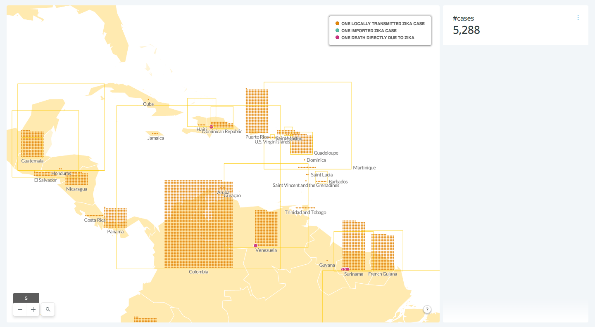
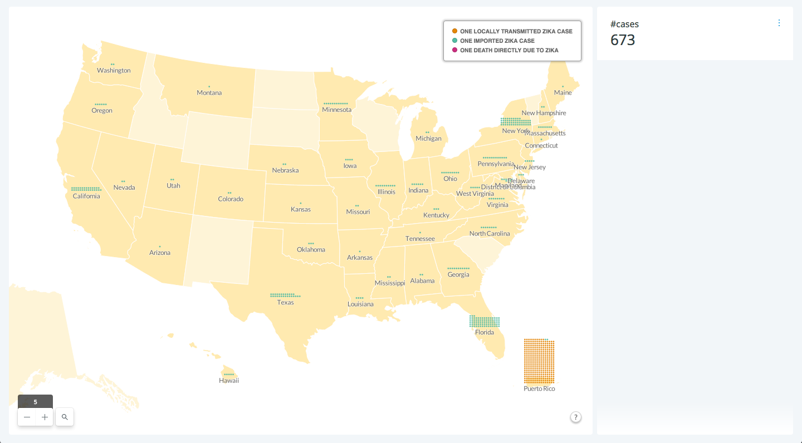
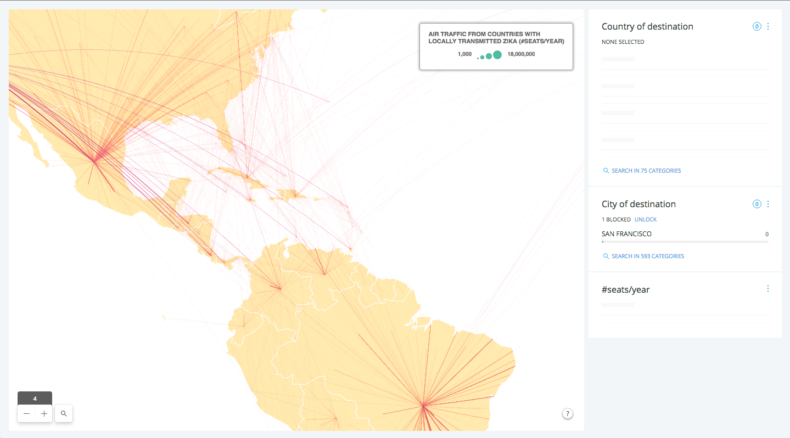
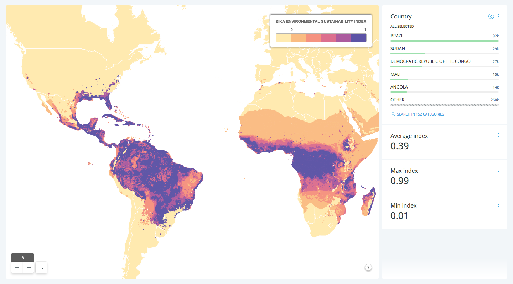
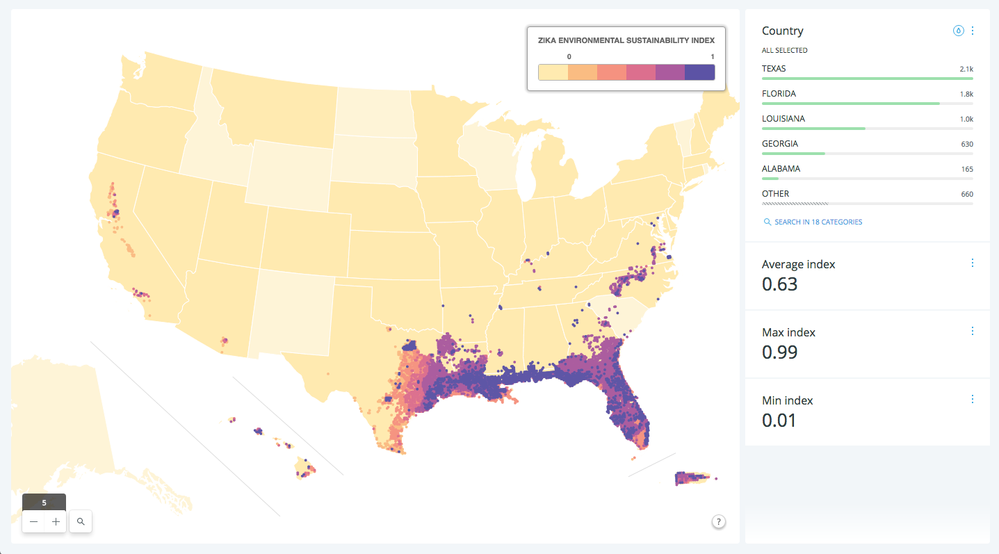
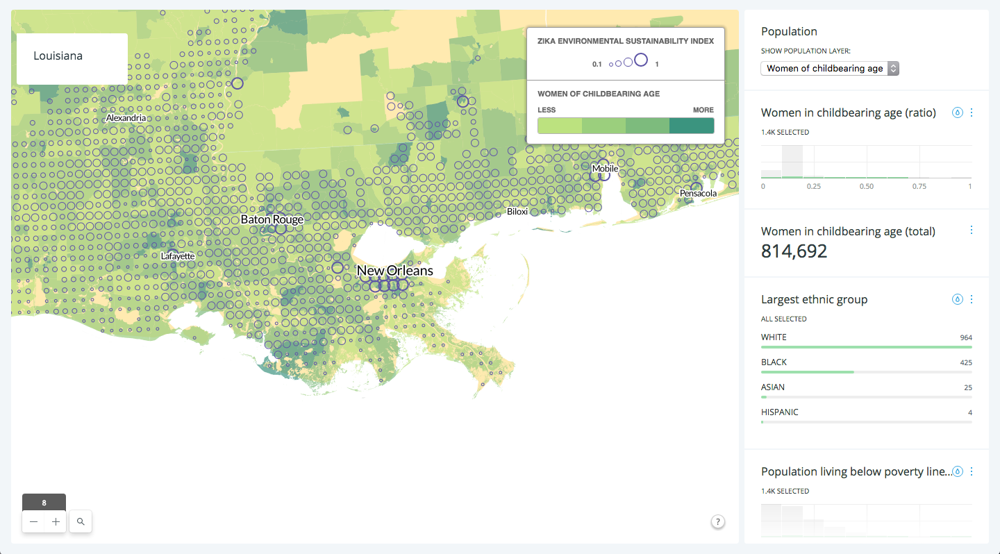
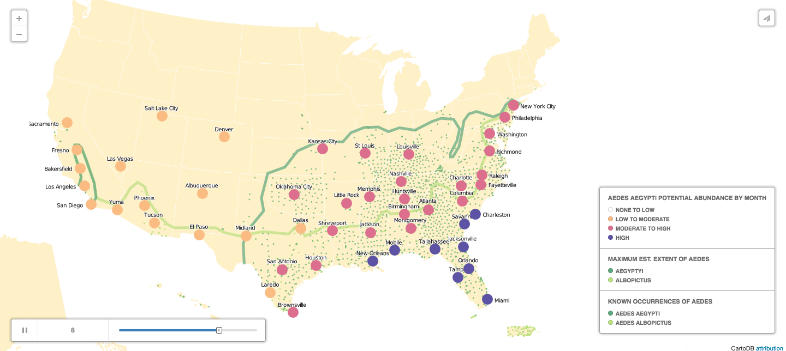

# The Zika virus explained through maps

All articles and data sources are listed here:
https://docs.google.com/spreadsheets/d/1boY2nW5pEPmvradMjgSVoxodAwUtrPnlFBahzQyOUww/edit#gid=0

## Intro

See https://en.wikipedia.org/wiki/2015%E2%80%9316_Zika_virus_epidemic

## On the evolution of the epidemy

> Q Dr. Fauci, how did this seem to catch us so by surprise?

> DR. FAUCI: It caught us by surprise not in the sense of what we should of known -- because for essentially, since the virus was first recognized in 1947 and the first human cases were 1952, it was a relatively inconsequential virus in the sense of a rather mild illness, virtually no mortality, no hints or signals of other things that we're seeing now. For example, the microcephaly, the congenital abnormalities, or Guillain-Barré.

> And what happened? And we don’t have all the answers to this -- when it then had its first outbreak, and the first outbreak was in the Yap Islands, that when things started to explode. And we still didn’t get all the information from them. And only when it hit a vulnerable, big population with a lot of mosquitos, with people who have never exposed to this before, did we then start seeing the unfolding of this scenario that every week, every month, it tends to surprise us even more. But the initial part of it, there was really no reason to be very suspicious that this would be bad. It was one of those viruses that just gave a mild illness.Q Dr. Fauci, how did this seem to catch us so by surprise?

> DR. FAUCI: It caught us by surprise not in the sense of what we should of known -- because for essentially, since the virus was first recognized in 1947 and the first human cases were 1952, it was a relatively inconsequential virus in the sense of a rather mild illness, virtually no mortality, no hints or signals of other things that we're seeing now. For example, the microcephaly, the congenital abnormalities, or Guillain-Barré.

> And what happened? And we don’t have all the answers to this -- when it then had its first outbreak, and the first outbreak was in the Yap Islands, that when things started to explode. And we still didn’t get all the information from them. And only when it hit a vulnerable, big population with a lot of mosquitos, with people who have never exposed to this before, did we then start seeing the unfolding of this scenario that every week, every month, it tends to surprise us even more. But the initial part of it, there was really no reason to be very suspicious that this would be bad. It was one of those viruses that just gave a mild illness.

^ DR. SCHUCHAT, Whitehouse Press Briefing by Press Secretary Josh Earnest, 4/11/16, https://www.whitehouse.gov/the-press-office/2016/04/11/press-briefing-press-secretary-josh-earnest-41116

## map: the global situation, cases worldwide

DATA SOURCE: Wikipedia (https://en.wikipedia.org/wiki/Zika_virus_outbreak_(2015%E2%80%93present))

This map shows the number of cases for each country of the world.
There is an important distinction to make between imported cases (in teal) and locally transmitted cases, most likely by the biting of a carrying mosquito (in orange in the map).
Zika has started to be fatal (red dots in the map) in some places (4 in Brazil, 4 in Suriname).
Squares size is proportional to the amount of suspected cases, in some cases 100 times the number of confirmed cases as in Brazil.

## map: the situation in the US

DATA SOURCE: CDC (http://www.cdc.gov/zika/geo/united-states.html)

> We are quite concerned about Puerto Rico, where the virus is spreading throughout the island. We think there could be hundreds of thousands of cases of Zika virus in Puerto Rico, and perhaps hundreds of affected babies. We know that the pregnant women in Puerto Rico are very keen to protect themselves and to have community protection, and we're working closely with the authorities in Puerto Rico to support that response with mosquito control beginning and with the distribution of what we call Zika prevention kits for pregnant women.

>Q Thank you. Doctor, you mentioned you expected there to be hundreds of thousands of cases in Puerto Rico. Do you have a prediction or a range of how many you expect in the United States broadly?

>DR. SCHUCHAT: You know, much of our predictions come from what we saw with dengue virus and chikungunya virus, and those two viruses are also spread by the same mosquito. In Puerto Rico, they ranged between 25 and 80 percent of the population getting infected with one or the other of those viruses over the course of one or multiple seasons.

> In the continental U.S., those -- we have seen travel-associated cases of chikungunya and dengue. We haven’t seen large numbers, we haven’t seen thousands of cases of locally transmitted disease from the mosquitoes. We’ve seen dozens of cases. But we absolutely need to be ready.

> As Dr. Fauci was saying, everything we look at with this virus seems to be a bit scarier than we initially thought. And so while we absolutely hope we don’t see widespread local transmission in the continental U.S., we need the states to be ready for that. And that was part of what our summit was about -- learning all they could about mosquito control, what do we know, what do we now know, what can we do with the tools that we have today, and how to get ready for mosquito season; when they have a case of travel-associated, how to look around that individual for the mosquitoes nearby.

> (...)

>So I don’t expect there to be large outbreaks in the continental U.S. I can’t give a number to how many cases, but I can say that we can't assume we're not going to have a big problem. We know with other viruses we've had bigger problems than we expected, so we're taking this very seriously.

^ DR. SCHUCHAT, Whitehouse Press Briefing by Press Secretary Josh Earnest, 4/11/16, https://www.whitehouse.gov/the-press-office/2016/04/11/press-briefing-press-secretary-josh-earnest-41116

No locally transmitted case has been recorded in continental US as of now, but with summer coming this is likely to happen, in Florida but also elsewhere (see further maps)
Puerto Rico and Hawaii have been already heavily affected by the virus.

## map: how the epidemy travels

DATA SOURCE: PlaneStats.com

Zika spread like other arboviruses (viruses carried by insects) such as dengue and chikungunya / typical outbreak :
- an infected traveller arrives to an area
- mosquitoes of the Aedes genus picks up the virus bites the traveller
- mosquitoes start biting, outbreak starts

Zika is asymptomatic in 80% of cases thus making prevention even harder.

> We really want the traveling public, when they come back from the Caribbean or Latin America, to use repellant for the couple weeks after they return, because if they silently got Zika infection and they get bit by a mosquito in the continental U.S., that mosquito can then spread the virus.

^ DR. SCHUCHAT, Whitehouse Press Briefing by Press Secretary Josh Earnest, 4/11/16, https://www.whitehouse.gov/the-press-office/2016/04/11/press-briefing-press-secretary-josh-earnest-41116

## map: worldwide areas at risk (how likely is zika to affect your country)

DATA SOURCE:
- Zika environmental sustainability index: Oxford Research https://elifesciences.org/content/5/e15272

A recent research (April 19th) greatly helped us providing fine grained data on what areas of the world and the US are at risk and further finding out demographics of these areas.

By running a computer simulation, researchers from the University of Oxford were able to determine, for each part of the globe, how likely was Zika to spread.

More precisely, how environmental factors (environmental suitability) will or will not accelerate the spreading of the virus.

>The latest research showed mapping Zika was more complex than simply defining where the mosquito can survive.
One of the researchers, Dr Oliver Brady from the University of Oxford, told the BBC: "These are the first maps to come out that really use the data we have for Zika - earlier maps were based on Zika being like dengue or chikungunya.
"We are the first to add the very precise geographic and environmental conditions data we have on Zika."
By learning where Zika could thrive the researchers could then predict where else may be affected. The researchers confirmed that large areas of South America, the focus of the current outbreak, are susceptible.
In total, 2.2 billion people live in areas defined as being "at risk".

^ BBC http://www.bbc.com/news/health-36090650

>A large portion of global tropical and subtropical regions have highly suitable environmental conditions and are at the greatest risk. These areas are inhabited by over 2.17 billion people.

>Scientists led by the University of Oxford and the Institute for Health Metrics and Evaluation, Seattle, have produced a fine-scale global map of Zika virus transmission. This map was produced by identifying areas of the world with similar environment and socioeconomic characteristics as areas where the virus has been reported so far. These characteristics include simple weather variables such as precipitation and land cover, but also complex temperature-based virus incubation models. Separate analysis produced range maps for the primary mosquito vector of Zika, Aedes aegypti.

>"We have comprehensively assembled all the data for Zika occurrence in humans, displayed it as a map, and combined it with detailed predictions of where the virus could spread next," says lead author Janey Messina from the University of Oxford.

>"Our global risk map reveals priority regions where authorities could intervene to control the vector population and where surveillance of the virus should be concentrated in order to improve rapid outbreak response and clinical diagnosis."

>An existing map provided by the US Centre for Disease Control shows the potential range for two mosquito vectors, Ae. aegypti and Ae. albopictus. However, it does not provide any information on whether the mosquitoes could spread disease in these areas, nor does it take into account the specifics of the latest Zika case data.

>To create the current maps, the researchers focused on six variables. Temperature is an important predictor of whether adult female mosquitoes can survive long enough to take a blood meal from a human and lay a batch of eggs. It also determines whether the virus can incubate for long enough in mosquitoes - this requires about 10 days. The researchers included data for both Ae. aegypti and Ae. albopictus, although Ae. aegypti has proven to be most effective at transmitting Zika virus.

>Higher rainfall is associated with higher infection risk for other mosquito-borne viruses of the same family, such as dengue. The mosquitoes lay their eggs in static water. Finally, urban areas are particularly suitable for transmitting Zika because female Ae. aegypti favour the blood of humans over other animals. Only the females bite and transmit disease and they take regular blood meals from humans during the day to provide the nutrition needed to produce eggs. Urban areas also provide plenty of breeding sites, particularly artificial containers holding water.

^ http://www.eurekalert.org/pub_releases/2016-04/e-wnf042016.php

## map: US areas at risk

DATA SOURCE:
- Zika environmental sustainability index: Oxford Research https://elifesciences.org/content/5/e15272

> The southeastern US, including much of Texas through to Florida, have ideal conditions for spread of Zika virus according to a new study published in eLife.

>The results show that although potential the range of Ae. aegypti and Ae. albopictus in the US is much larger, the focus for action should be the southeastern region, including most of Texas and the whole of Florida. In these and other global areas on the map assessed as "highly suitable" for transmission of the virus, an infected person could not only import the virus but risk infecting others.

^ http://www.eurekalert.org/pub_releases/2016-04/e-wnf042016.php

## map: looking at "at risk" populations in the US

DATA SOURCES:
- Women in childbearing age by tract, largest ethnic group by tract, pop. below poverty line by tract: 2013 US Census
- Zika environmental sustainability index: Oxford Research https://elifesciences.org/content/5/e15272

## map: Aedes

DATA SOURCES:
- potential Aedes abundance by month, Aedes extent http://currents.plos.org/outbreaks/article/on-the-seasonal-occurrence-and-abundance-of-the-zika-virus-vector-mosquito-aedes-aegypti-in-the-contiguous-united-states/
- Known occurrences of Aedes http://www.nature.com/articles/sdata201535#data-records

The mosquito : the deadliest animal in the world.

>We have learned that the mosquito vector, the Aedes aegypti mosquito, is present in a broader range of states in the continential U.S.. So instead of about 12 states where the mosquito, Aedes aegypti is present, we believe about 30 states have the mosquito present.

^ DR. SCHUCHAT, Whitehouse Press Briefing by Press Secretary Josh Earnest, 4/11/16, https://www.whitehouse.gov/the-press-office/2016/04/11/press-briefing-press-secretary-josh-earnest-41116

>Zika has been spreading throughout the Western Hemisphere, carried mainly by a type of mosquito called Aedes aegypti. While the virus is now a major concern in countries such as Brazil, Venezuela, and El Salvador, it hasn't yet become a big problem in the United States. Yes, there have been a few dozen cases within our borders. But these cases have all originated abroad or have been transmitted through sexual activity.

>Still, US health officials are worried that Zika will come to infect the Asian tiger mosquito, a species of mosquito that has a much wider range in the United States than Aedes aegypti. If that were to happen, we could see a spiraling outbreak like the one that's occurring in Central and South America. In those regions, Zika has infected millions and is also believed to be fueling an uptick in a birth defect called microcephaly.

>The nightmare scenario is unlikely. "Any outbreaks of Zika in the continental United States will likely be limited," the Centers for Disease Control and Prevention has assured the public. Screened-in windows and air conditioning units are more common here than in those countries, and they keep mosquitoes out of our homes. Plus, the state that is most at risk, Florida, has lots of experience dealing with outbreaks of mosquito-borne diseases like dengue fever and chikungunya.

>But the truth remains that some US cities are more at risk than others.

>The National Center for Atmospheric Research produced the map above after analyzing the relative Zika risk of 50 US cities.

>Its research, which was published online today in PLOS Current Outbreaks, combines meteorological records, simulation of Aedes aegypti mosquito population growth, estimates of human-mosquito exposure, and transportation data.

>The researchers' aim is to look ahead at the summer months and help public health officials prepare for potential Zika outbreaks. To be clear, the virus isn't circulating in the local mosquito population yet: The only cases are from travel and sexual transmission. "For local transmission to occur [Zika virus] would have to be introduced by infected travelers or infected mosquitoes and become sustained in local Aedes mosquito populations," the researchers write.

>The new map shows the places where — if this were to happen — there would be a higher risk of outbreaks in the coming months. While the Aedes aegypti, the mosquito most likely to transmit the virus in the US, can't tolerate the cold of winter in many US cities, its numbers start to increase as temperatures rise. (The exceptions are Florida and Texas, where the mosquitoes can live year-round.)

>It's not an absolute ranking. Rather, the map shows where the most critical factors align to cause an outbreak. Overall, the findings are pretty simple. Generally: Cities with the highest levels of travel, the highest numbers of mosquitoes in peak summer months, and those that are in the climate range in which the mosquitoes thrive are the most at risk.

>You can see on the map that these three factors are all highest in Florida, which has already declared a state of emergency. The state is already revving up disease surveillance and mosquito control efforts.

>The study does note that all the 50 cities could, in theory, have a climate suitable for the mosquitoes by mid-July. (But there's really no reason to fear they'd suddenly make a home in cities they historically haven't been found in.) But as a general rule, Southeastern cities — with their somewhat tropical climate and abundant mosquitoes — are the most at risk. The researchers also note there's a chance, due to El Niño, that this summer will be hotter than normal, fueling additional mosquito hatchings in the Southeast.

^ http://www.vox.com/2016/3/16/11248468/zika-virus-risk/in/10579041
